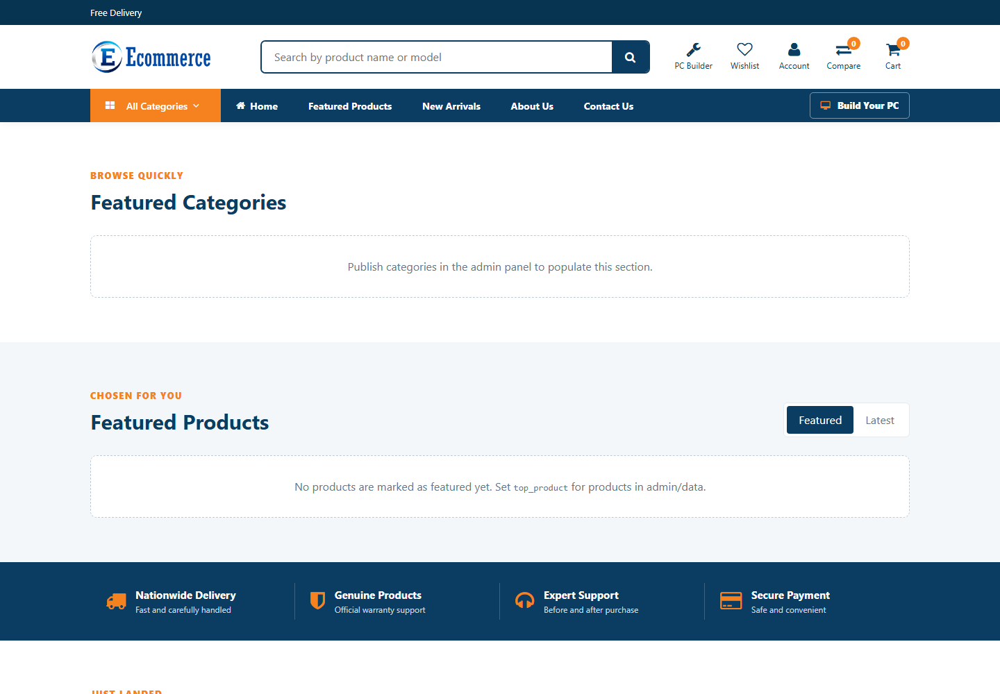
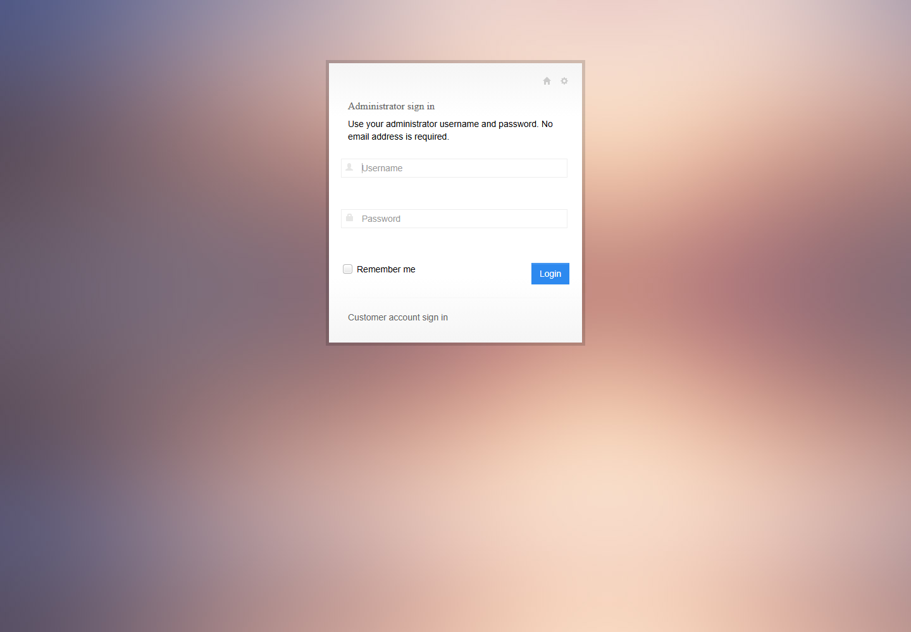

<div align="center">

# Ecommerce

### A modern, white-label commerce platform for technology retailers

[](https://laravel.com/)
[](https://www.php.net/)
[](#quality-and-testing)
[](#license)

Responsive storefront · Bangladesh-ready payments · Inventory and purchasing · Business-focused administration

</div>

---

## Overview

Ecommerce is a Laravel-powered platform for computers, laptops, networking equipment, accessories, and other technology products. It combines a responsive customer storefront with checkout, customer self-service, inventory, purchasing, reporting, integrations, and a role-aware administration workspace.

The name **Ecommerce** is only the default installation identity. Store name, logos, contact information, SEO metadata, social links, announcements, and other public branding can be changed from the administration panel without editing source code.

## Screenshots

### Customer storefront



### Administrator sign-in



> Screenshots reflect the local demonstration database. Catalog sections populate automatically when published categories and products are available.

## What is included

| Area | Capabilities |
| --- | --- |
| Storefront | Responsive homepage, catalog browsing, search, specifications, comparison, wishlist, reviews, questions, stock alerts, and PC builder |
| Sales | Cart, coupons, delivery zones, checkout, order tracking, invoices, Bangladesh payment methods, manual-payment review, and EMI plans |
| Customer care | Customer accounts, returns, refunds, credit notes, warranty/service claims, support requests, and notifications |
| Catalog | Categories, subcategories, manufacturers, products, attributes, pricing, imports, exports, and media |
| Operations | Multi-location inventory, suppliers, purchasing, stock receipts, transfers, and low-stock workflows |
| Growth | Banners, announcements, customer segments, campaigns, abandoned carts, analytics, SEO, and configurable branding |
| Administration | Role-based permissions, activity history, sales reports, system monitoring, backups, API clients, and signed webhooks |

## Technology

- PHP 8.3 or newer
- Laravel 13
- MySQL or MariaDB
- Blade, Bootstrap, jQuery, Vue 2, and Laravel Mix
- PHPUnit 12

> [!IMPORTANT]
> Both the command-line runtime and web server must use PHP 8.3 or newer. Verify with `php -v` before installing dependencies or running Artisan.

## Quick start

### Requirements

- PHP 8.3+ with Laravel and `pdo_mysql` extensions
- Composer 2
- MySQL or MariaDB
- Node.js and npm only when rebuilding frontend assets

### Installation

```bash
git clone <repository-url>
cd ecommerce
composer install
```

Create the environment file:

```powershell
# Windows PowerShell
Copy-Item .env.example .env
php artisan key:generate
```

```bash
# macOS or Linux
cp .env.example .env
php artisan key:generate
```

Configure the database in `.env`:

```dotenv
APP_NAME="Ecommerce"
APP_URL=http://127.0.0.1:8000

DB_CONNECTION=mysql
DB_HOST=127.0.0.1
DB_PORT=3306
DB_DATABASE=ecommerce
DB_USERNAME=root
DB_PASSWORD=
```

Prepare and run the application:

```bash
php artisan migrate
php artisan config:clear
php artisan serve --host=127.0.0.1 --port=8000
```

Open [http://127.0.0.1:8000](http://127.0.0.1:8000). The administrator login is at [http://127.0.0.1:8000/admin/login](http://127.0.0.1:8000/admin/login).

### Frontend assets

The repository includes public assets. Rebuild them only when frontend source files change:

```bash
npm install
npm run dev
```

Use `npm run production` for an optimized build.

## Create the first administrator

Run all migrations and open Tinker:

```bash
php artisan tinker
```

Then create or update the initial administrator:

```php
$roleId = DB::table('admin_roles')->where('name', 'Super Admin')->value('id');

DB::table('tbl_admin')->updateOrInsert(
    ['admin_name' => 'admin'],
    [
        'full_name' => 'Default Administrator',
        'admin_email' => 'admin@example.com',
        'role_id' => $roleId,
        'is_active' => 1,
        'admin_password' => Hash::make('replace-with-a-unique-password'),
        'created_at' => now(),
        'updated_at' => now(),
    ]
);
```

> [!WARNING]
> Replace the example password before running the command. Use a unique password of at least 12 characters and never publish production credentials.

## Configuration

The `.env` file controls the application URL, database, mail, cache, sessions, queues, and other environment-specific behavior. Never commit `.env`, database exports, backups, private API keys, or production credentials.

### Branding and public information

Open **Administration → Website Settings** (`/site-customization`) to configure:

- Store name, tagline, logos, and favicon
- Support email, phone, WhatsApp, address, and business hours
- Footer content and copyright text
- SEO metadata, robots directives, analytics, and social profiles
- Homepage content, notices, and public contact actions

Announcements and top-bar contact actions are managed separately at `/top-bar-management`. Homepage banners have their own management workspace so each public communication channel remains understandable.

### Payment methods

The payment workspace at `/payment-methods` supports Bangladesh-focused methods, including manual mobile financial services, cash on delivery, bank transfer, cards, gateways, QR payments, and EMI rules. Credentials remain protected and are not displayed in ordinary administration views.

## Security baseline

- CSRF protection for state-changing web actions
- Role-based administrator authorization
- Secure, HttpOnly, SameSite session-cookie support
- Browser security headers and Content Security Policy
- Escaped storefront content and safe JSON-LD encoding
- Redacted secrets in administrator activity history
- HTTPS-only, public-address validation for webhook destinations
- Hashed administrator passwords and API tokens

For production, enable HTTPS, keep `APP_DEBUG=false`, use strong unique credentials, configure off-site backups, and place the application outside the public document root.

## Quality and testing

Run the complete test suite:

```bash
php artisan test
```

Useful release checks:

```bash
composer validate --strict
composer audit
php artisan view:cache
php artisan route:list --except-vendor
```

The current verified baseline is **42 passing tests with 355 assertions** and no known Composer security advisories.

## Project structure

```text
app/Http/Controllers/    Storefront and administration controllers
app/Http/Middleware/     Authentication, authorization, audit, and security boundaries
app/Services/            Reusable business and integration services
database/migrations/     Database schema and feature migrations
docs/screenshots/        README screenshots
public/                  Web entry point and public assets
resources/views/         Blade pages and components
routes/                  Storefront, customer, API, and administration routes
tests/                   PHPUnit unit and feature tests
```

## Production deployment

### Recommended cPanel layout

```text
/home/CPANEL_USER/ecommerce/       Laravel application
/home/CPANEL_USER/ecommerce/public Domain document root
```

1. Select PHP 8.3+ in **MultiPHP Manager** and enable Laravel/MySQL extensions.
2. Create a MySQL database and user, then grant the user all required privileges.
3. Upload the project outside `public_html` and point the domain document root to the project's `public` directory.
4. Copy `.env.cpanel.example` to `.env` and replace every placeholder.
5. Enable SSL and set production values:

   ```dotenv
   APP_ENV=production
   APP_DEBUG=false
   APP_URL=https://example.com
   SESSION_SECURE_COOKIE=true
   SESSION_HTTP_ONLY=true
   SESSION_SAME_SITE=lax
   ```

6. From cPanel Terminal, run:

   ```bash
   composer install --no-dev --optimize-autoloader
   php artisan migrate --force
   php artisan config:cache
   php artisan view:cache
   ```

7. Ensure `storage` and `bootstrap/cache` are writable by the web server.

Generate `APP_KEY` only for a new installation. Never replace an existing production key, because encrypted credentials and active sessions may become unreadable.

### cPanel without Terminal

Run `composer install --no-dev --optimize-autoloader` locally with PHP 8.3+, then upload the project including `vendor`. Import a prepared database using phpMyAdmin or ask the hosting provider to run migrations. Generate a new-installation key locally with `php artisan key:generate --show` and place it in the server `.env`.

If the host cannot change the document root, keep the Laravel application outside `public_html`, copy only the contents of `public` into `public_html`, and update the two paths in `public_html/index.php`. Never expose `.env`, `vendor`, backups, or the complete application directory publicly.

## Production checklist

- [ ] PHP 8.3+ is active for both CLI and web requests
- [ ] `APP_ENV=production`, `APP_DEBUG=false`, and `APP_URL` uses HTTPS
- [ ] The existing `APP_KEY` is preserved during updates
- [ ] Database and administrator credentials are unique and strong
- [ ] Session cookies are Secure, HttpOnly, and SameSite
- [ ] SMTP, queues, scheduled jobs, and payment credentials are configured as needed
- [ ] Database and uploaded media are backed up off-site
- [ ] `storage` and `bootstrap/cache` permissions are correct
- [ ] Tests, Composer audit, migrations, and cache builds pass before release
- [ ] `php artisan serve` is not used as the production web server

## License

This project declares the MIT license in `composer.json`. See the repository license file, when present, for the complete terms.
